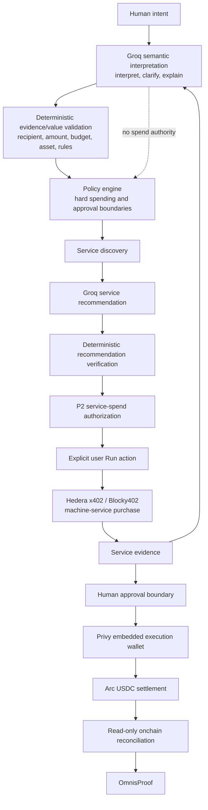
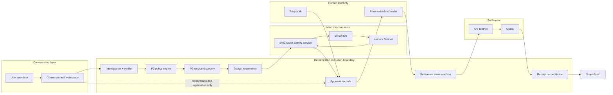

<div align="center">

# useOmnis

> **Delegate the financial task, not your wallet.**

[](https://ethglobal.com/events/ethonline2026)
[](https://github.com/Devendurance/Omnis)
[](https://nextjs.org/)
[](https://www.typescriptlang.org/)
[](https://hedera.com/)
[](https://www.arc.network/)
[](https://www.privy.io/)
[](./LICENSE)

**useOmnis is a bounded financial execution agent.** A user gives Omnis a
financial task, budget and rules. Groq interprets natural language and
recommends bounded machine services, but deterministic validation and P2
remain authoritative over recipients, amounts, service eligibility, budgets,
approval and execution.

Built for **ETHOnline 2026**.

</div>
---

## Why useOmnis exists

AI can already research, plan, compare, summarize, and recommend.

The moment that work requires money, the human usually has to take over.

You still have to:

- find the service or data source;
- subscribe to an API or manage credentials;
- check the recipient;
- decide what the agent is allowed to spend;
- switch networks or wallets;
- sign the transaction;
- verify settlement;
- save the receipt.

That breaks delegation.

If you hired a human operator, you would not give them your bank password and say "do anything." You would say:

> Get this done. You have a budget. You may spend within these rules. Ask me before you cross this boundary. Keep the receipts.

**useOmnis brings that operating model to AI agents.**

The agent gets enough financial authority to complete the task, not unrestricted access to your money.

---

## The job

> **Turn financial intent into controlled, completed, and provable action.**

```text
Task + Budget + Rules
        |
        v
      Omnis
        |
        +--> discover what is needed
        +--> buy services inside policy
        +--> collect evidence
        +--> stop at approval boundaries
        +--> settle authorized payments
        |
        v
      Proof
```

The product shift is simple:

```text
From:
"I need to figure out how to do this."

To:
"I need this done, under these rules."
```

---

## Who it is for

useOmnis is initially for **crypto-native founders, builders, operators, contributors, researchers, and small teams** that already use AI to get work done and stablecoins to pay for work.

Typical jobs include:

- paying a contractor after a verification step;
- letting a research agent buy API or data access within a budget;
- giving an agent a small operating allowance without giving it unrestricted wallet access;
- automating recurring financial workflows that still need human approval at defined boundaries;
- keeping one readable proof record across machine spend, human approval, and settlement.

The long-term user is not "everyone with a wallet."

It is the person or team already delegating work to software and asking:

> **How do I safely delegate the parts that involve money?**

---

## The flagship flow

The canonical useOmnis mandate is:

> **"Pay this contractor 0.10 USDC, but check the wallet first. Spend no more than $0.05 checking."**

Omnis turns that one sentence into explicit financial boundaries:

| Part | Meaning |
|---|---|
| Outcome | Pay the contractor |
| Final payment | 0.10 USDC |
| Dependency | Check the recipient wallet first |
| Service budget | Maximum $0.05 |
| Discovered service | Wallet activity check |
| Service price | $0.003 |
| Remaining after service | $0.047 |
| Machine rail | Hedera Testnet x402/HTS USDC |
| Final rail | Arc Testnet USDC on Arc Testnet |
| Agent authority | May purchase the service within policy |
| Human boundary | Final contractor payment requires explicit approval |
| Proof | Preserve service payment, observations, approval, and settlement evidence |

The shipped flow is:

```text
Human intent
    |
    v
Groq semantic interpretation
    |
    v
Deterministic evidence/value validation
    |
    v
Capability discovery
    |
    v
Bounded service candidates
    |
    v
Groq service recommendation
    |
    v
Deterministic recommendation verification
    |
    v
P2 service-spend authorization
    |
    v
Explicit user Run action
    |
    v
Hedera x402 purchase
    |
    v
Service evidence
    |
    v
Human final-payment approval
    |
    v
Arc USDC settlement
    |
    v
Proof
```

---

## What is live today

The current hackathon MVP has been exercised with real testnet economic actions.

### Live-proven

- conversational task workspace;
- Groq semantic interpretation with deterministic evidence and value
  validation;
- deterministic payment, budget, recipient, and policy authority;
- bounded service budgets using integer atomic-unit accounting;
- deterministic service discovery;
- bounded Groq service recommendation with deterministic verification;
- a live x402-gated wallet-activity service on Hedera Testnet;
- real x402 v2 payments settled through Blocky402;
- HTS USDC service payment at exactly `3000` atomic units, or `$0.003`;
- factual wallet observations kept separate from heuristic interpretation;
- Privy authentication and embedded EVM execution wallet;
- owner-scoped task state and refresh-safe persistence;
- explicit human approval before final settlement;
- real Arc Testnet USDC transfer;
- read-only reconciliation with exact ERC-20 `Transfer` log verification;
- no automatic retry after ambiguous signing or submission;
- multi-rail proof that keeps machine spend separate from final settlement;
- truthful test-mode semantics that do not pretend a `0.01 USDC` test transfer
  fulfilled a `0.10 USDC` mandate.

### Not yet claimed as live-proven

These are product-direction items, not current hackathon claims:

- automatic recipient-chain detection across arbitrary supported chains;
- "pay any address, regardless of chain" routing;
- production multichain settlement;
- Circle Unified Balance as the funding source for the flagship flow;
- a fully LLM-driven financial planner;
- the `0.10 USDC` contractor mandate being executed in the test-mode proof
  shown below.

We intentionally keep the README explicit about that boundary.

---

## Live evidence

### Hedera machine-service payment

- Network: `hedera:testnet`
- Payment protocol: x402 v2, exact scheme
- Facilitator: Blocky402
- Asset: HTS USDC `0.0.429274`
- Service price: `3000` atomic units = `$0.003`
- Verified payment identifier:

```text
0.0.7162784@1788995118.130839662
```

The protected service is:

```text
POST /api/services/wallet-activity
```

An unpaid call returns `402 Payment Required`. A valid paid request returns factual wallet observations only after the x402 payment is verified and settled.

### Arc settlement proof

- Network: Arc Testnet
- Chain ID: `5042002`
- USDC ERC-20 interface: `0x3600000000000000000000000000000000000000`
- Confirmed test transfer: `0.01 USDC`
- Confirmed block: `61303876`
- Transaction:

[`0xe16824170d9fb8bf8551be3877a80a425328a21ca158b21201301e6b087f7b7d`](https://testnet.arcscan.app/tx/0xe16824170d9fb8bf8551be3877a80a425328a21ca158b21201301e6b087f7b7d)

The proof bundle records that the `0.10 USDC` mandate was **not executed**
during this test-mode settlement.

---

## Why this is different from a payment bot

useOmnis is not designed around "give an AI a wallet."

It is designed around **bounded financial agency**.

Three boundaries stay separate:

### 1. Conversation and reasoning

The conversational layer understands the user's requested outcome, asks for missing information, explains progress, and presents evidence.

### 2. Deterministic financial control

Code, not model text, controls:

- budgets;
- asset and network allowlists;
- service caps;
- recipient values;
- owner identity;
- approval requirements;
- transaction parameters;
- state transitions;
- settlement truth;
- idempotency;
- receipt verification.

### 3. Human authority

The human remains the final authority wherever the policy says approval is required.

An LLM response can never count as transaction truth.

---

## Conversational intelligence

The shipped workspace uses Groq for semantic interpretation and bounded
service recommendation. The model improves understanding and comparison;
deterministic validation and P2 remain the authority for anything financial.

### Shipped interpretation and recommendation

The request path is:

1. Groq extracts semantic slots from the user's natural language.
2. Deterministic evidence/value validation grounds those slots in the source
   text, pending intent, task values, and known evidence.
3. Capability discovery builds a bounded candidate set from the trusted
   registry and P2 facts.
4. Groq recommends or compares at most one candidate.
5. Deterministic verification accepts only a current, executable candidate.
6. P2 authorizes service spend, and the user explicitly presses `Run`.

The recommendation card labels verified Groq output `Recommended by Omnis`,
marks the rationale as `advisory · model suggestion`, and renders
deterministic `Why this service` facts separately. A recommendation has zero
spend authority.

### What the model may and may not do

THE MODEL MAY:

- interpret;
- clarify;
- recommend or compare;
- explain.

THE MODEL MAY NOT:

- sign;
- authorize spend;
- bypass P2;
- invent financial truth;
- mark settlement complete;
- create proof.

The shipped architecture is:



This keeps language understanding and comparison flexible while the parts
that move money remain deterministic and human-gated.

---

## Architecture



### Trust model

**Flexible:**

- conversation;
- Groq semantic interpretation;
- explanation;
- bounded service recommendation;
- result synthesis.

**Deterministic:**

- money;
- budgets;
- recipients;
- authorization;
- policies;
- signing boundaries;
- submission state;
- reconciliation;
- proof.

---

## Sponsor architecture

Each integration has one clear job.

### Hedera: machine commerce

Hedera powers the agent's paid service consumption.

The service flow demonstrates an agent that can:

1. discover a service;
2. understand its cost;
3. reserve budget before payment;
4. receive an x402 challenge;
5. pay in HTS USDC through Blocky402;
6. receive the protected result;
7. persist the payment identifier and evidence.

No API key or subscription is required for the user.

### Privy: human identity and execution wallet

Privy is the human authorization layer.

It provides:

- authentication;
- the user's embedded self-custodial EVM wallet;
- the `primaryExecutionWallet`;
- EIP-1193 access for controlled Arc execution;
- chain switching;
- explicit wallet approval;
- owner isolation.

External connected wallets are not silently substituted for the execution wallet.

### Arc: final stablecoin settlement

Arc is the final USDC settlement rail for the current MVP.

The settlement flow includes:

- preflight;
- exact recipient and amount binding;
- explicit human approval;
- transaction-hash persistence;
- read-only confirmation;
- exact ERC-20 `Transfer` verification;
- ArcScan evidence;
- proof generation.

### Circle App Kit and Unified Balance

Circle App Kit / Unified Balance foundations are integrated and explored in the settlement layer, but **Unified Balance is not the funding source of the live-proven flagship settlement**.

That is deliberate.

The next settlement milestone is to let Omnis source USDC from unified liquidity and hide chain selection from the user.

---

## From shipped MVP to the product vision

The current MVP proves:

```text
Intent
-> bounded machine spend
-> evidence
-> human approval
-> Arc settlement
-> proof
```

Future product direction expands that to:

```text
Intent
-> recipient address detection
-> unified liquidity
-> route selection
-> bounded machine spend
-> approval policy
-> multichain settlement
-> proof
```

The user should eventually be able to say:

> **"Pay Alice 0.10 USDC."**

and not care:

- where their USDC currently sits;
- which chain Alice's address belongs to;
- whether a bridge is required;
- which route settles fastest;
- which wallet/network UI needs to be switched.

The rails should disappear.

Control and proof should remain visible. These routing capabilities are not
claimed as shipped universal cross-chain behavior.

---

## Safety and execution invariants

useOmnis is intentionally conservative around writes.

### Money

Financial values use integer atomic units and explicit decimals.

No floating-point JavaScript math is used for authoritative payment values.

### Service budget

For the flagship service:

```text
Configured service budget:
$0.05 = 50,000 six-decimal units

Wallet activity service:
$0.003 = 3,000 units

Remaining:
47,000 units = $0.047
```

### Before a paid service call

The runtime must:

1. authenticate the user;
2. load the owner-scoped task;
3. load the policy snapshot;
4. verify the selected descriptor;
5. authorize the spend;
6. reserve the exact quote;
7. only then begin payment.

### After signing or possible submission

useOmnis does not blindly retry.

Ambiguous outcomes enter recovery state and require read-only reconciliation.

### Final settlement

A final payment can only become confirmed from trusted onchain evidence.

UI text and model text cannot mark money as delivered.

---

## Proof

useOmnis does not end at "transaction sent."

It builds a proof bundle that can include:

### Mandate

- task ID;
- original intent;
- normalized purpose;
- requested amount;
- recipient.

### Machine service

- service;
- cost;
- settlement network;
- x402 payment identifier;
- factual observations;
- separate heuristic flags.

### Human control

- authenticated owner;
- approval record;
- execution wallet;
- policy context.

### Final settlement

- authorized amount;
- token;
- network;
- transaction hash;
- confirmed block;
- timestamp;
- reconciliation source.

### Outcome

- completed payment, or
- truthful demo verification where the original mandate was not executed.

The proof is designed to answer:

> What was requested? What was the agent allowed to do? What did it spend? What did the human approve? What actually settled?

---

## Product experience

`/app` is a conversation, not a transaction form.

The interface uses:

- user and Omnis conversation turns;
- inline task-plan cards;
- budget cards;
- service-discovery cards;
- truthful paid/pending/failed service-result cards;
- compact human-approval cards;
- settlement-progress cards;
- verified proof summaries;
- a persistent composer.

Financial state is rendered from persisted domain state, not fabricated chat copy.

---

## Current status

| Capability | Status |
|---|---|
| Conversation-first product UI | Live |
| Groq semantic interpretation | Live, bounded and fail-closed |
| Deterministic evidence/value validation | Live |
| Bounded Groq service recommendation | Live, verified before use |
| Deterministic policy engine | Live |
| Service discovery | Live |
| Hedera x402 service | Live |
| Real Blocky402 payment | Live-proven |
| HTS USDC machine spend | Live-proven |
| Privy authentication | Live |
| Privy embedded wallet | Live |
| Human approval boundary | Live |
| Arc USDC settlement | Live-proven |
| Exact onchain reconciliation | Live |
| Proof bundle | Live |
| Refresh-safe owner session | Live |
| Circle Unified Balance foundation | Integrated, not flagship-proven |
| Unified-balance funded settlement | Planned |
| Automatic recipient-chain detection | Planned |
| Multichain final payment routing | Planned |
| Arbitrary supported-address payment | Product vision |

---

## Tech stack

| Layer | Technology |
|---|---|
| Application | Next.js 16, React 19, TypeScript |
| UI | React, CSS |
| Testing | Playwright |
| LLM interpretation | Groq OpenAI-compatible API, GPT-OSS 20B default |
| Recommendation | Groq strict JSON Schema plus deterministic verifier |
| Authentication | Privy |
| Execution wallet | Privy embedded EVM wallet |
| Agent policy | Deterministic useOmnis domain engine |
| Service discovery | useOmnis registry |
| Machine payment | x402 v2 |
| Machine settlement | Hedera Testnet + Blocky402 |
| Machine asset | HTS USDC |
| Final settlement | Arc Testnet |
| Final asset | USDC |
| Circle foundation | Circle App Kit / Unified Balance integration |
| Proof | useOmnis deterministic proof model |

---

## Project structure

```text
src/
  app/
    api/
      services/
      tasks/
    app/
      approvals/
      proof/
      services/
      tasks/
      wallet/
  components/
    composer.tsx
    conversational-cards.tsx
    thinking-indicator.tsx
  lib/
    auth/
    conversation/
    domain/
    intent/
    recommendation/
    services/
      hedera-x402/
      server/
    settlement/
      arc/
      circle/
      final/
    tasks/

docs/
  ai-development.md
  demo-runbook.md
  deployment.md
  submission-checklist.md
  submission-copy.md
  submission-evidence.md

tests/
  automated domain and browser regression coverage
```

---

## Local setup

### Prerequisites

- Node.js compatible with the project lockfile;
- npm;
- a Privy app;
- Hedera Testnet payer configuration if exercising the paid x402 flow;
- a funded Arc Testnet execution wallet for manual settlement testing.

### Install

```bash
git clone https://github.com/Devendurance/Omnis.git
cd Omnis
npm install
cp .env.local.example .env.local
```

Fill the local environment values.

Never commit `.env.local`.

### Environment categories

Public:

```env
NEXT_PUBLIC_PRIVY_APP_ID=
NEXT_PUBLIC_ENABLE_P6B_TEST_MODE=
```

Server-only values include the Hedera payer/service configuration and Privy server credential.

Typical server-only variables used by the project include:

```env
PRIVY_APP_SECRET=

HEDERA_TESTNET_PAYER_ACCOUNT_ID=
HEDERA_TESTNET_PAYER_PRIVATE_KEY=
HEDERA_X402_SERVICE_ACCOUNT_ID=

BLOCKY402_TESTNET_URL=https://api.testnet.blocky402.com

OMNIS_PUBLIC_ORIGIN=

OMNIS_LLM_PROVIDER=groq
OMNIS_LLM_MODEL=openai/gpt-oss-20b
OMNIS_LLM_API_KEY=
OMNIS_LLM_BASE_URL=https://api.groq.com/openai/v1
```

Demo and deployment-specific flags are documented in:

```text
docs/deployment.md
```

Use `.env.local.example` as the source of truth for the current variable names.

### Start

```bash
npm run dev
```

Open:

```text
http://localhost:3000/app
```

---

## Testing

The latest observed repository-wide run reported:

```text
732 passed
1 failed response-motion timing test
1 flaky screenshot test
```

The response-motion test passes 8/8 in isolation. Lint, typecheck, build,
and no-em-dash checks all passed. The full suite is intentionally not rerun
during this packaging phase.

Run:

```bash
npm run test
npm run lint
npm run typecheck
npm run build
npm run check:no-em-dash
```

Automated tests do not intentionally perform live financial writes.

---

## Judgeable demo strategy

The hosted product is designed with a split between public evidence and restricted writes.

### Public

Judges can inspect:

- the product experience;
- the conversational workspace;
- service registry;
- verified historical hackathon evidence;
- the public x402 challenge;
- architecture and proof.

### Restricted writes

Server-funded live service purchases are intentionally gated.

This prevents a public deployment from becoming an unrestricted faucet funded by the project operator.

The recorded demo shows the complete write path.

---

## ETHOnline 2026

useOmnis is targeting three partner integrations with clear, non-decorative roles.

### Hedera: AI & Agentic Payments

useOmnis demonstrates:

- a live x402-gated service on Hedera Testnet;
- Blocky402 settlement;
- HTS USDC;
- real paid requests;
- agent-side service discovery;
- bounded service budgets;
- no API subscription or user-managed API key;
- persisted payment evidence.

### Arc: DeFi / Onchain Finance

useOmnis uses Arc as the current final settlement rail for:

- stablecoin-native payment;
- explicit human approval;
- deterministic transaction preparation;
- USDC settlement;
- exact receipt/log verification;
- proof.

### Privy: Financial Flow

Privy is central to:

- authentication;
- embedded wallet creation/resolution;
- execution-wallet identity;
- Arc chain switching;
- explicit wallet approval;
- owner isolation;
- removing private-key management from the product UX.

---

## Roadmap

### Immediate

- complete public deployment and hosted smoke tests;
- record the final ETHOnline demo with the verified recommendation and
  explicit Run and approval gates;
- submit the final ETHOnline package and evidence.

### Next

- Circle Unified Balance funded settlement;
- recipient-chain detection;
- source-liquidity discovery;
- multichain USDC routing;
- service-provider marketplace;
- richer paid data / inference services.

### Later

- recurring agent budgets;
- team approval policies;
- higher-risk approval escalation;
- durable server-side task history;
- agent-to-agent economic workflows;
- service reputation and discovery;
- production mainnet settlement.

---

## Product principles

1. **Intent first.** Users should describe the outcome, not the rails.
2. **Bounded authority.** An agent receives permission to do a job, not unrestricted wallet control.
3. **Deterministic money.** Models may reason; deterministic code controls funds.
4. **Human boundaries stay human.** Approval means explicit approval.
5. **No fake certainty.** Pending, failed, ambiguous, confirmed, and test-mode states remain distinct.
6. **Proof is part of the product.** Completion should end with evidence, not a success toast.
7. **Rails should disappear.** Network complexity belongs underneath the product.
8. **Control should remain visible.** Hiding infrastructure must never mean hiding authority.

---

## Start Fresh

The repository history begins with `first commit` on 2026-09-11. It is
followed by commits titled `build useOmnis hackathon MVP`, `build useOmnis
ETHOnline MVP`, and `added license and readme`. On that verified history,
useOmnis is a fresh repository/project created for ETHOnline 2026.

Earlier conceptual experiments are distinct from this repository: they are
not represented as ancestors or source lineage in this Git history. No
backdated, fabricated, or reconstructed history is claimed.

### Major libraries and SDKs

- Next.js 16.3.4, React 19.2.8, and TypeScript 5
- Tailwind CSS 4
- Playwright 1.63 with axe-core for browser testing
- viem 2.56 for EVM transactions and reconciliation
- `@x402/core` and `@x402/hedera` 2.25 for x402 payments
- Privy Node and React Auth SDKs for authentication and embedded wallets
- Circle App Kit and `@circle-fin/adapter-viem-v2`
- GSAP, `@gsap/react`, Lenis, and Lucide React for the interface
- jose and server-only for server-side auth and module boundaries

---

## AI-assisted development

AI tools assisted research, planning, coding, debugging, and documentation under human direction.

Human-directed decisions include:

- product thesis;
- user and job-to-be-done;
- bounded-agency model;
- sponsor architecture;
- financial authority boundaries;
- approval semantics;
- test-mode truthfulness;
- manual live-payment decisions.

Every live financial action used for hackathon verification required explicit human execution.

See:

```text
docs/ai-development.md
```

for the repository disclosure.

---

## Security notes

- private wallet keys are never intentionally persisted to browser state;
- Hedera payer credentials remain server-only;
- Privy server credentials remain server-only;
- browser-provided owner identity is not trusted as authority;
- owner subject is verified server-side;
- no payment occurs during page render, hydration, registry lookup, or automated test startup;
- known post-signing ambiguity never causes automatic payment retry;
- Arc confirmation requires onchain evidence;
- test mode is server-authorized and visually disclosed;
- service observations and heuristic interpretations are rendered separately.

This is hackathon software and has not undergone a production security audit.

---

## Documentation

- [`docs/deployment.md`](./docs/deployment.md) - deployment and production environment
- [`docs/demo-runbook.md`](./docs/demo-runbook.md) - judge/demo flow
- [`docs/submission-evidence.md`](./docs/submission-evidence.md) - sponsor evidence map
- [`docs/submission-copy.md`](./docs/submission-copy.md) - ETHGlobal submission copy
- [`docs/submission-checklist.md`](./docs/submission-checklist.md) - final submission gate
- [`docs/ai-development.md`](./docs/ai-development.md) - AI-assisted development disclosure

---

## License

MIT. See [`LICENSE`](./LICENSE).

---

<p align="center">
  <strong>Give Omnis the task, the budget, and the rules.</strong><br/>
  It can spend what it needs to make progress, stop where you told it to stop, and keep the proof.
</p>
